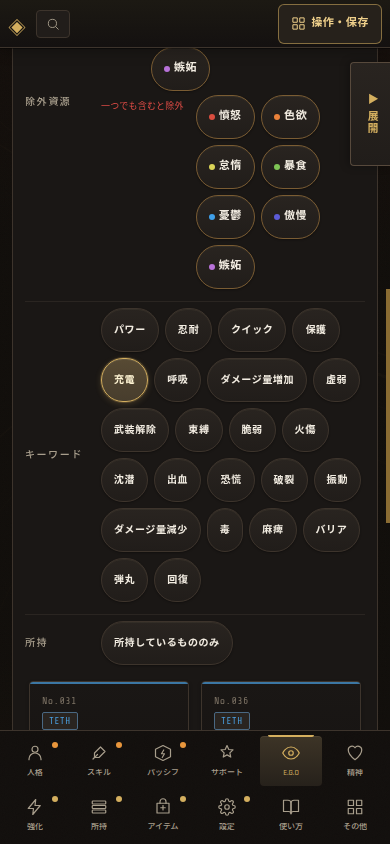

# E.G.Oキーワードフィルター — PDF基準順の検証記録

## 基準資料と表示規則

基本ルールPDFのバフ（303〜304頁）、デバフ（306〜307頁）、中立バフ（310頁）、弾丸（312頁）の掲載ブロック順を基準とした。E.G.Oの本文に現れる`回復`はPDFの状態名ではない検索専用語のため、正式掲載項目の後ろへ置く。

| 掲載ブロック | LBTの表示順 |
| --- | --- |
| バフ | パワー、忍耐、クイック、保護、充電、呼吸、ダメージ量増加 |
| デバフ | 虚弱、武装解除、束縛、脆弱、火傷、沈潜、出血、恐慌、破裂、振動、ダメージ量減少、毒、麻痺 |
| 中立バフ | バリア |
| 弾丸 | 弾丸 |
| E.G.O本文検索専用 | 回復 |

## PC実画面検証

V65r49のE.G.O絞り込みで、上表と同じ順序の23キーワードを確認した。`呼吸`を選択すると7件へ絞り込まれ、キーワード選択機能が並び順固定後も維持されていることを確認した。

## 390px相当モバイル検証

390×844pxで`絞り込み`を開き、資源・キーワード・所持の各条件が同じ詳細パネルに表示されることを確認した。`充電`を選択した結果、候補は7件、キーワード列はPDF基準順と完全一致し、横オーバーフローは発生しなかった。

`ego-keyword-pdf-order-mobile.json`には、実際の順序、選択状態、候補数、表示寸法を保存している。

## 回帰確認

`tests/ego-keyword.test.mjs`でPDF基準順と`回復`を末尾に置く規則を固定し、`tests/ego-readability.test.mjs`でモバイルでは閉じた絞り込み中に資源行だけが残らない規則を追加した。
