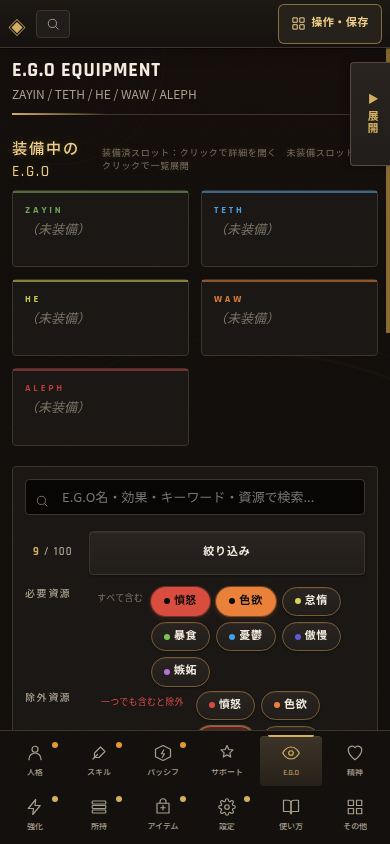

# E.G.O資源フィルターの検証記録

## 仕様

E.G.O一覧の絞り込みへ、既存の単一「大罪」条件に代えて、複数選択できる二つの条件を追加した。

| 条件 | 判定 |
| --- | --- |
| 必要資源 | 選択した資源を**すべて**消費資源として含むE.G.Oだけを残す。 |
| 除外資源 | 選択した資源を**一つでも**消費資源として含むE.G.Oを除く。 |
| 同じ資源の両指定 | 必要資源と除外資源は排他的に扱う。一方で選ぶと、反対側の同じ指定を自動解除する。 |
| 既存条件との併用 | 名称・効果検索、ランク、キーワード、所持のみの各条件と同時に適用される。 |

## PC実画面検証

ローカルLBTでE.G.O一覧を全件表示し、次の実データ検証を行った。

| 操作 | 候補数 | 確認内容 |
| --- | ---: | --- |
| 条件なし | 100 | E.G.O全件が一覧に表示された。 |
| 必要資源：憤怒 | 45 | 憤怒を消費するE.G.Oだけが残った。 |
| 必要資源：憤怒・色欲 | 15 | 2資源をともに含むE.G.Oだけが残った。 |
| 除外資源：怠惰を追加 | 9 | 憤怒・色欲を持ち、かつ怠惰を含まないE.G.Oだけが残った。 |

除外後の9件を目視し、すべてに憤怒・色欲があり、怠惰が含まれないことを確認した。操作後にブラウザ実行時エラーは発生しなかった。

## 390px相当モバイル検証

390×844pxで、憤怒・色欲を必要資源、怠惰を除外資源として設定した。候補数は9件、表示カード数は9件で一致した。各カードは必要資源を含み、除外資源を含まず、横オーバーフローは発生しなかった。

`ego-resource-filter-mobile.json`に、選択状態と実測結果を保存している。

## 自動テスト

`tests/ego-readability.test.mjs`へ、複数必要資源のAND判定、除外資源のOR除外、相反指定の解除、必要・除外UIの回帰条件を追加した。関連テストおよび`tests/*.test.mjs`の全回帰実行が成功している。
