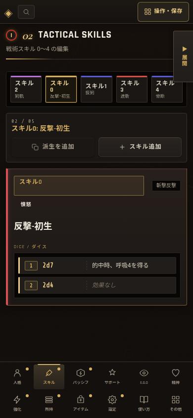

# スキル下側カードの選択・横ドラッグ検証記録

## 修正内容

下側のスキルカード一覧では、横ドラッグ後に発火する`click`だけを抑止していた。しかし、その抑止状態が次の新しいクリックへ残る場合があり、カードを一度押しても選択されないことがあった。

新しい`pointerdown`が始まった時点で、直前のドラッグだけに属する抑止状態を解除するよう修正した。これにより、ドラッグ自体が発火した直後の誤クリックは従来どおり抑止しつつ、次のカード選択は一度のクリック・タップで処理される。

## PC実操作検証

| 操作 | 結果 |
| --- | --- |
| 下側カードの通常クリック | 選択カードと上側の編集フォームが即時に切り替わる。 |
| 水平ドラッグ | 一覧は横に22px以上スクロールし、ドラッグ対象カードは選択されない。 |
| ドラッグ直後の別カードクリック | 一度のクリックで別カードが選択される。追加クリックは不要。 |
| 並べ替えグリップ・矢印 | 通常の選択と区別され、既存の並べ替え操作を維持する。 |

## 390px相当モバイル検証

390×844pxでは、下側カード一覧を非表示にし、画面上部のスキル直接選択チップを使用する既存設計を維持した。5件のスキルチップから未選択のものを一度タップすると選択状態が切り替わり、横オーバーフローは発生しなかった。

## 自動テスト

`tests/skill-strip-scroll.test.mjs`へ、横ドラッグ由来の抑止状態を新しい`pointerdown`で解除する回帰条件を追加した。スキル一覧関連テストと`tests/*.test.mjs`の全回帰実行が成功している。
