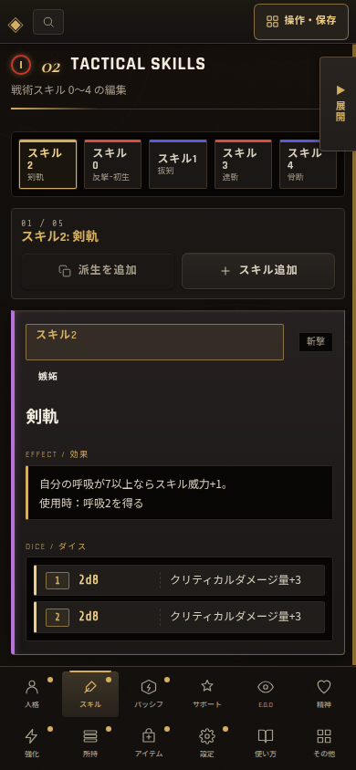

# スキル編集の矢印キー移動案内検証記録

## 修正内容

スキル編集上部の「← → キーでも移動」は、背景色に近い弱い文字色と小さな文字サイズだけで表示されていた。プレビューを展開したときは周辺情報も密集するため、操作案内を見落としやすかった。

案内を金色系の文字色、薄い金色の背景、境界線、余白を備えた小さなバッジとして表示するようにした。スキル名や前後移動ボタンより強くならない補助情報として保ちつつ、背景から独立して読めるようにしている。

## PC・プレビュー展開時の検証

プレビューを展開したPC実画面で、案内バッジがスキル名の右側に表示され、矢印文字と「キーでも移動」を視認できることを確認した。右矢印キーを押すと`スキル2: 剣軌`から`スキル0: 反撃-初生`へ切り替わり、案内表示によって既存のキーボード移動は変化していない。

## 390px相当の検証

390×844pxでは、キーボード操作を主要導線としない既存方針に従い、案内は非表示のままにして画面密度を保つ。上部のスキル直接選択チップは表示され、横オーバーフローは発生しなかった。

## 自動テスト

`tests/skill-strip-scroll.test.mjs`へ、案内バッジの高コントラストな境界線・背景・文字色、および390px相当向けのスタイル条件を回帰条件として追加した。`tests/*.test.mjs`の全回帰実行が成功している。
